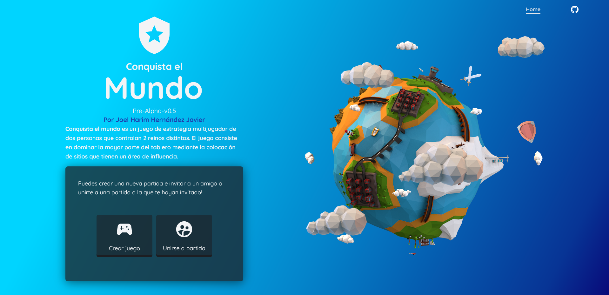
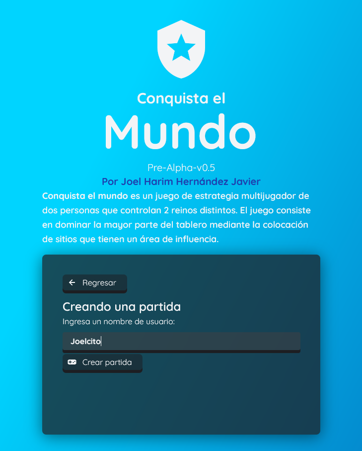
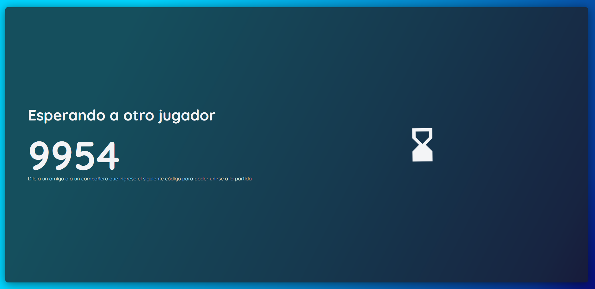
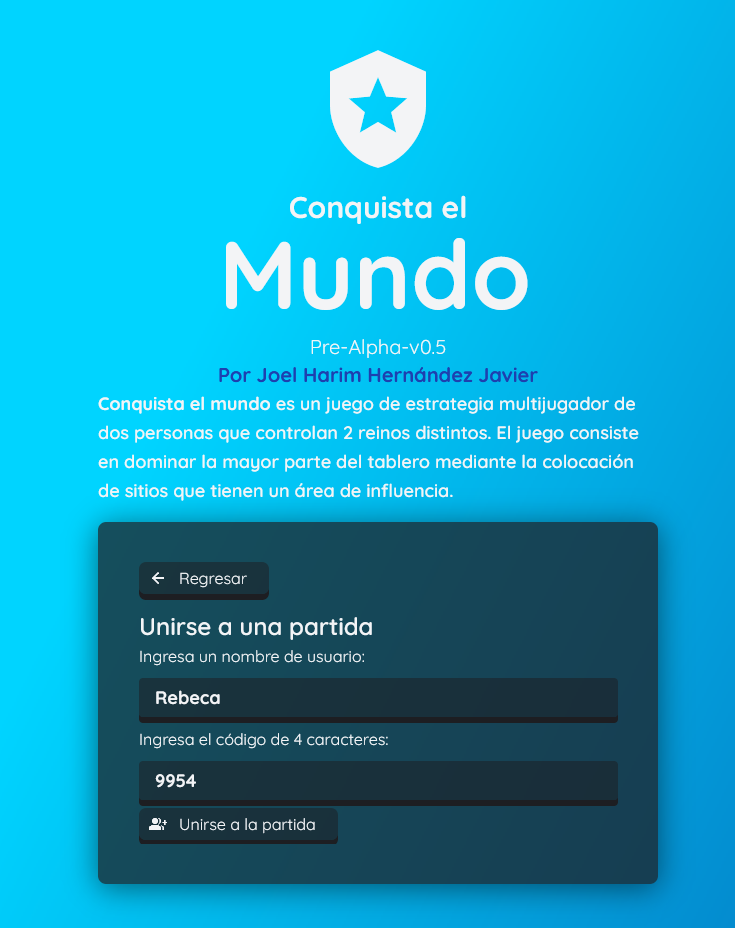
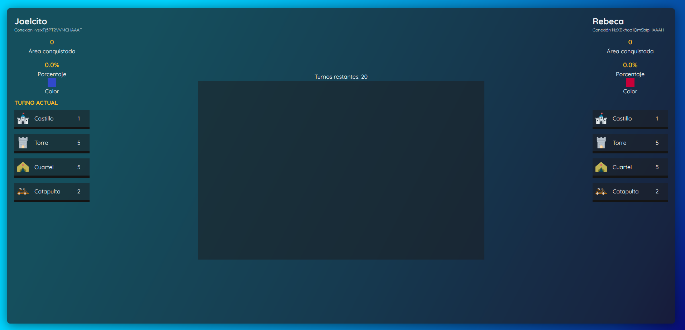
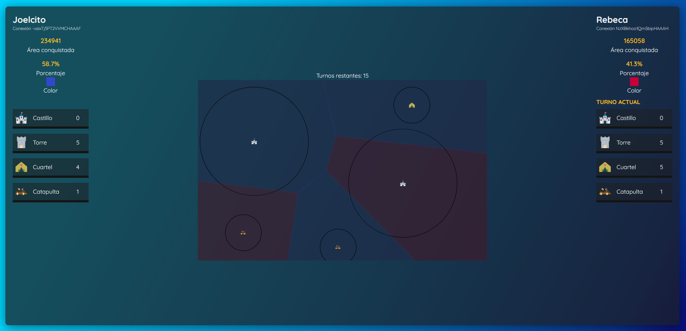
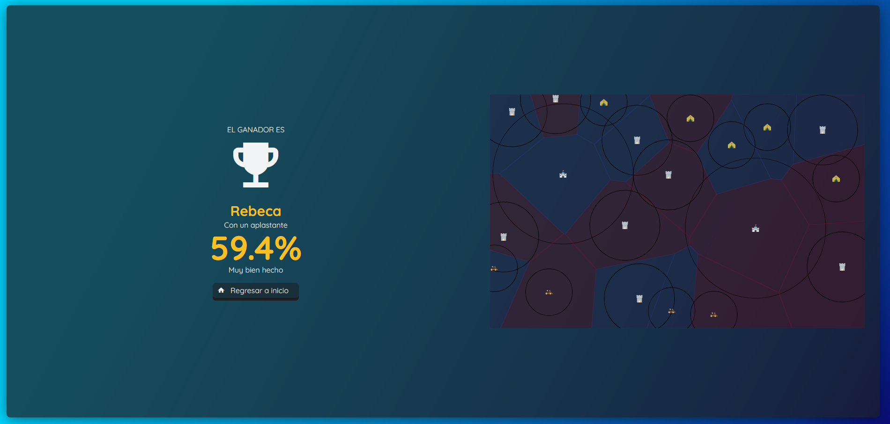

# Conquer the world

## Description



This is a two-player online game that consists in conquer territories from your enemy and defend yours.

Each player can add points of conquest on the main zone and each one will produce Voronoi regions.

In order to add points of conquest, the player will have different types of buildings to collocate, all of them with different protection ratios where the enemy won’t be able to build sites of conquest.

The winner will be the player that conquer most of the territory.

## Used technologies

- React Js
- Socket.IO
- Express JS

## Usage

First, install all dependencies for client and server

```
cd server
npm i
cd ../client
npm i
```

Next, build client using npm:

```
// For Node v17+
npm run build:v17
// For previous Node versions
npm run build
```

Next, run server:

```
cd ../server
npm run start
```

Open your browser on [`localhost:3000`](localhost:3000) or in your LAN your server's IP and the port `3000`

## Captures

Creating match:



Player joining:


Match recently created:



Match finished:

